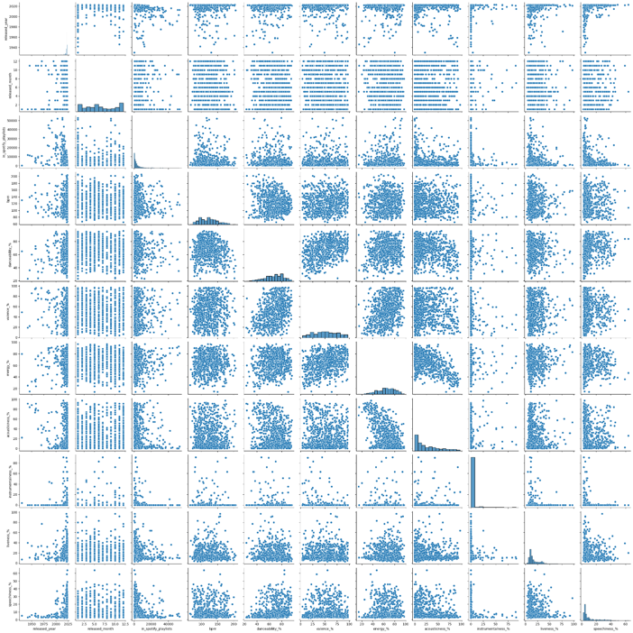
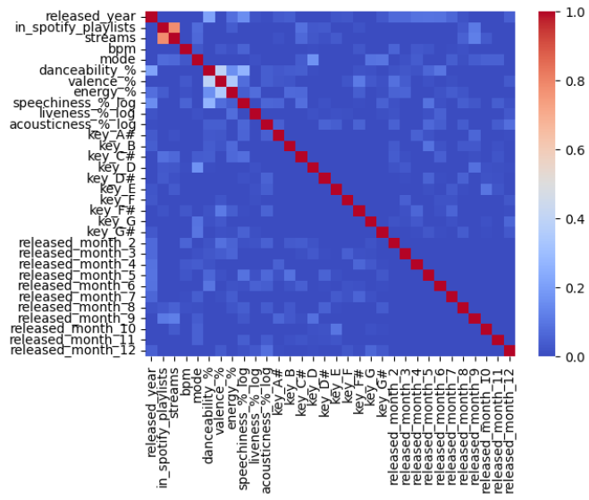

This file contains deep dives into technical details in the following files:

- [cleaning.py](#optional-technical-deep-dive---cleaningpy)
- [preprocessing.py](#optional-technical-deep-dive---preprocessingpy)

---

### Optional Technical Deep Dive - cleaning.py

While the Kaggle dataset used was relatively clean, I prepared it for use using these steps:

- Handled encoding issues when reading the CSV file using `Pandas`. The default `utf-8` encoding caused a `UnicodeDecodeError`, so I implemented a try-except mechanism that tries common encodings (i.e., `latin1`, `cp1252`), which are representations of the text in the file) until the file loads successfully.

- Explored the dataset using `
df.info()` and viewed all rows in VSCode’s interactive window to understand the structure and spot any anomalies.

- Removed duplicate rows based on track_name, using `df.drop_duplicates(track_name)` to ensure each song appears only once.

- Dropped rows with missing values using `df.dropna(how='any')` to avoid issues during model training.


References:
- I used Google AI’s input based on searching the following: "How to resolve UnicodeDecodeError when loading csv file using `Pandas`.

---

### Optional Technical Deep Dive - preprocessing.py
---
**Feature Selection**

Certain columns were removed from the dataset based on the following considerations:

- Incompatible data types for modelling
- Little or no predictive value (potentially adding noise to the model)
- No clear relationship with the target variable (streams) based on initial inspection

---

**Exploratory Data Analysis (EDA)**

A scatter plot matrix was created using `sns.pairplot()` to explore the relationships between variables. This included:

- Scatter plots for each pair of features
- Histograms showing the distribution of each feature

<br>


<br>

---

**Handling Low-Variance Features**

The 'instrumentalness_%' column was dropped as most of its values were zero, meaning it:

- had very low variance
- was unlikely to contribute to the model’s performance

---

**Label Encoding Categorical Variable**

The 'mode' column, which contained the values "Major" and "Minor", was converted to binary format (1 for Major and 0 for Minor) to be compatible with the model.

---

**Data Cleaning**

One row was removed after identifying incorrect data during the preprocessing stage. This issue had been missed during the initial data cleaning stage.

---

**Data Type Conversion**

The streams column was converted from `object` to `int64`, as it represents numerical values.

---

**SQL Queries for Descriptive Statistics**

The `pandasql` library was used to perform simple SQL queries on DataFrames. For instance, the following query was used to retrieve the minimum and maximum BPM values:

```sql
query_minmaxbpm = "SELECT MIN(bpm) AS min_bpm, MAX(bpm) AS max_bpm FROM df_processed"
minmaxbpm = sqldf(query_minmaxbpm)
print(minmaxbpm)
```

Although this operation could have been carried out more efficiently using `Pandas`, SQL was used here to demonstrate proficiency with SQL and to show how similar operations can be achieved using different approaches.

---

**Log-normalisation of Variables**

Since the predictor variables “liveness_%”, “acousticness_%” and “speechiness_%” have lognormal distributions observed from the histograms in the scatter plot matrix, these variables were transformed using `NumPy` by taking their logarithm with `np.log()`. This made their values more normally distributed. Afterwards, the columns that contained the original values were dropped.

---

**One-hot Encoding of Categorical Predictor Variables**

The predictor variables ”key” and “release_month” are categorical (i.e., they contain text labels). To make them compatible with machine learning algorithms like Random Forests, they are one-hot encoded using a custom `onehotencode()` function:

```python
def onehotencode(df, column_name):
    """One-hot encode variable"""

    encoder = OneHotEncoder(drop='first', sparse_output=False)
    encoded_data = encoder.fit_transform(df[[column_name]])
    feature_names = encoder.get_feature_names_out(input_features=[column_name])
    encoded_data_df = pd.DataFrame(data=encoded_data, columns=feature_names, index=df.index)

    # Combine transformed features (columns) with original data
    df_encoded = pd.concat(objs=[df, encoded_data_df], axis=1)

    # Drop original column to avoid redundancy
    df_encoded = df_encoded.drop(columns=[column_name], axis=1)

    return df_encoded
```

Using `drop='first'` ensures that one category is omitted from the encoding, which avoids the dummy variable trap (i.e., a form of perfect multicollinearity where two or more predictor variables are perfectly correlated with each other).

While multicollinearity isn't a major issue for tree-based models like Random Forests (since the decision trees naturally selects the most informative splits), avoiding it can reduce training time and model complexity.

One-hot encoding transforms categorical variables into binary columns, allowing the model to process them as numerical inputs.

---

**Further EDA: Checking Multicollinearity**

- **Correlation heatmap**

Using `Seaborn` and `Matplotlib`, a correlation heatmap was plotted using a correlation matrix. This heatmap gives an overview of the degree of correlation between any two predictor variables by displaying correlation coefficients within the range [0, 1].

Code for the heatmap:

```python
def correlation_heatmap(df_encoded):
    corr_matrix = df_encoded.corr(method='pearson', numeric_only=True)
    sns.heatmap(corr_matrix, cmap='coolwarm', vmin=0.0, vmax=1.0)
    plt.show()
```

<br>


<br>

The heatmap showed that no 2 predictor variables have correlation > 0.5 (i.e., ignoring the "streams" variable since that is the target variable), suggesting likely there is no significant multicollinearity. Nevertheless, this conclusion is to be confirmed using Variance Inflation Factor(VIF).

- **Variance Inflation Factor(VIF) with `statsmodels`**

```python
def calculate_VIF(df_encoded):
    """Calculate VIF for each predictor variable to quantify the extent of multicollinearity"""

    # Create a copy of df_encoded but keep only the predictor variables
    df_predictors_only = df_encoded.drop(['streams'], axis=1).copy()

    # Adds a constant to the predictors matrix so the intercept term is included, preventing misleading VIF values or computational errors
    X = sm.add_constant(df_predictors_only)

    vif_data = pd.DataFrame()
    vif_data['feature'] = X.columns

    # Loop through each column and calculate its VIF
    # X.shape[1] returns number of columns in the DataFrame X
    vif_data['VIF'] = [variance_inflation_factor(X.values, i) for i in range(X.shape[1])]
    print(vif_data)
```

It was found that all independent variables have a VIF value of between 1.05 and 2.33. This indicates moderate correlation, which is acceptable.

---

**Scaling Variables with MinMaxScaler**

Originally, a linear regression model was used for this project. Since linear models are sensitive to feature magnitudes, several predictor variables were scaled to the range [0, 1] using `MinMaxScaler`.

However, the model was later switched to a random forest regressor, which does not require feature scaling. This is because decision trees split data based on threshold values rather than feature magnitudes, so scaling has no effect on the splits or model performance.

Nevertheless, this preprocessing step was retained intentionally to maintain flexibility for future experimentation with other machine learning models (e.g., logistic regression or support vector machines) that do depend on feature scaling.

Code for min-max scaling:

```python
scaler = MinMaxScaler()    # Initialise scaler

pd.set_option('display.max_rows', None)     # Displays all rows

# Select numeric predictor variables, excluding the target variable and boolean variables
scaler_input = df_encoded.loc[:, ['bpm', 'danceability_%', 'valence_%', 'energy_%', 'speechiness_%_log',  'liveness_%_log', 'acousticness_%_log']]

# Fit scaler to data, then transform data to [0, 1]
# Scaled values in each column stored as a DataFrame
df_scaled = pd.DataFrame(scaler.fit_transform(scaler_input))
```

Note:
Using `.loc` ensures that columns in the DataFrame are selected by label rather than position. This avoids issues caused by index misalignment if columns are later added or removed.

---

[Return to main README](README.md)
